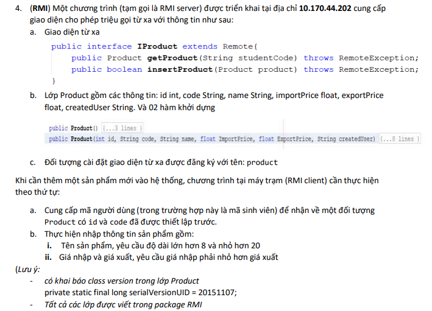

# Source code ôn tập môn lập trình mạng thầy Hùng
1. TCP:
Đề bài bài 1, 2, 3: gửi code là mã sinh viên lên server, nhận về một chuỗi gốm 2 số cách nhau bằng dấu phẩy có định dạng a,b, thực hiện tính tổng và gửi kết quả lên server
    * b1: DataStream 
    * b2: CharacterStream
    * b3: ByteStream
    * b4: ObjectStream
        - Tạo một lớp có tên là student với các thuộc tính:
            * id String,code String, name String, email String
        - Hàm khởi tạo:
            * public Student(String id, String code, String name, String email)
            * public Student(String code)
        - Trường dữ liệu: private static final long serialVersionUID = 20161107
        1. Gửi thông điệp là một đối tượng của lớp student với thông tin duy nhất được thiết lập là code bằng mã sinh viên của bạn
        2. Nhận một đối tượng là thể hiện của lớp Student từ server với các thông tin được thiết lập là id, code, name
        3. Thực hiện:
        -- Chuẩn hóa tên theo nguyên tắc: Chữ cái đầu tiên in hoa, các chữ cái còn lại in thường
        -- Tạo email ptit.edu.vn từ tên người dùng bằng cách lấy tên và các chữ cái bắt đầu của họ và tên đệm. Ví dụ: nguyen van tuan nam -> namnvt@ptit.edu.vn
2. UDP:
Đề bài tương tự phần TCP
    * b1: DataStream
    * b2, b3: tương tự b1
    * b4: ObjectStream
	
3. RMI:
	-- 
 
## Continue update.......

